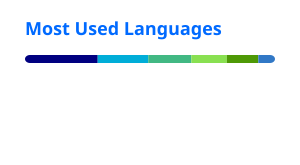

<div align=center>
 
</div>

<div align=center>
 
</div>

<!-- waka-box start -->
#### <a href="https://gist.github.com/ddee6660ea4819d749c4393b4cc8e382" target="_blank">📊 Weekly development breakdown</a>
```text
Lua         🕓 24h55m ██████████████████▏░░░░░░░ 69.9%
TypeScript  🕓 2h39m  █▉░░░░░░░░░░░░░░░░░░░░░░░░  7.4%
JSON        🕓 1h48m  █▎░░░░░░░░░░░░░░░░░░░░░░░░  5.1%
TOML        🕓 1h46m  █▎░░░░░░░░░░░░░░░░░░░░░░░░  5.0%
Python      🕓 55m    ▋░░░░░░░░░░░░░░░░░░░░░░░░░  2.6%
```
<!-- Powered by https://github.com/YouEclipse/waka-box-go . -->
<!-- waka-box end -->

<div align=center>
 <kbd> </kbd>
</div>
